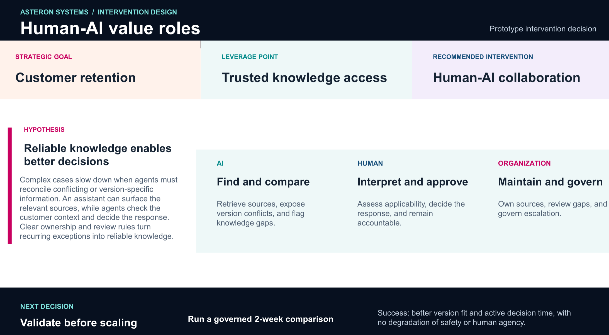

# 🤖 AI Company Analysis Agent

This project is a single-page analysis tool that reads company information from local Markdown files, processes it using an OpenAI Agent, and generates dynamic AI transformation questions.

## 📂 Folder Structure

```text
/elds
├── /backend
│   ├── server.js          # Node.js API & AI Logic
│   ├── .env               # Private API Key
│   └── package.json       # Dependencies
├── /frontend
│   └── index.html         # Analysis Dashboard (UI)
└── /unternehmen
    └── /elds
        └── info.md        # Company Data (Markdown)
```

# Setup Instructions
1. Install Dependencies
   Navigate to your backend folder in the terminal and run:

  ```bash
   npm install express openai dotenv gray-matter cors
   ```

2. Configure Environment
   Create a .env file inside the backend folder:

   ```text 
   OPENAI_API_KEY=sk-proj-YOUR_KEY_HERE
   Make sure your OpenAI account has a positive credit balance.
   ```
   
3. Folder Path Check
   Ensure your data is located at:
   ../unternehmen/elds/
   (The path logic in server.js is case-sensitive on Mac).

## How to Run
1. Start the Backend
   In the backend folder, run:
   ```bash   
   node server.js
   ```

   The terminal should say: "AI Agent Backend running on port 3000".
   AI agent we are using 
   
   Install in backend :
   ```bash
   npm install elevenlabs-node
      ```

2. Run the Frontend
   Open the frontend/index.html file in your browser.

   📝 Important Elements
   Auto-Progress Bar: The UI shows a real-time progress line as the agent reads the file and calls the AI.
   Dynamic Questions: Questions are not hardcoded; the OpenAI Agent generates them based specifically on the text found in your .md file.
   Success Fold: Once analysis is complete, the results "reload" into the page with a clean success card.


## Resume Project 

### AI Agent Workflow

1. **AI Agent: Analyze the Company**

   * Read and analyse the available company information with a given Analysation framwework.
   * Understand the company’s business model, products/services, departments, workflows, challenges, and current capabilities.
   * Identify potential opportunities where AI and human expertise can create value.

2. **AI Agent: Summarize the Company**

   * Provide a clear and concise company overview.
   * Highlight the most important findings, opportunities, challenges, and potential areas for improvement.

3. **AI Agent: Clarify the Goals**

   * Ask the user targeted questions to understand the company’s objectives.
   * Clarify priorities, desired outcomes, current problems, available resources, and expectations for AI.
   * Identify which decisions should remain with humans and which tasks could potentially be supported or performed by AI.

   
4. **AI Agent: Create the AI & Human Skills Dashboard**

   * Build a clear dashboard showing:

      * **Business Goals**
      * **AI Opportunities**
      * **AI Skills and Capabilities Required**
      * **Human Skills and Capabilities Required**
      * **AI vs. Human Responsibilities**
      * **Priority Areas**
      * **Skills Gaps**
      * **Recommended Actions**
      * **KPIs and Success Metrics**

6. **AI Agent: Recommend the Next Steps**

   * Identify the highest-priority opportunities.
   * Recommend which processes should be automated, augmented, or remain human-led.
   * Define the skills, roles, training, and AI capabilities needed to achieve the company’s goals.
   * Provide a practical roadmap for implementation.

## Final View

